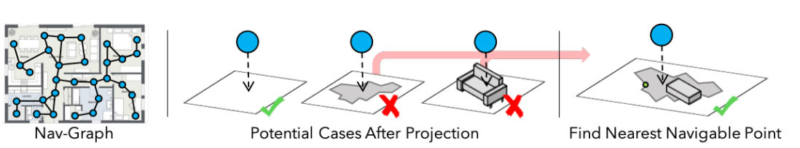
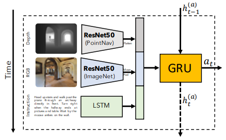
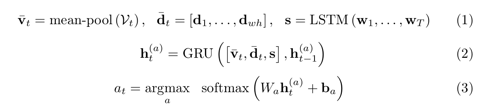
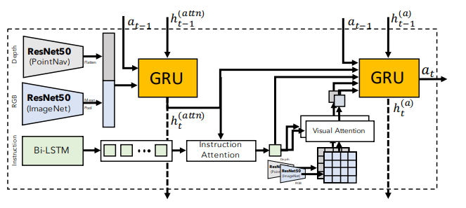

## 一、文章大概内容介绍

这篇论文提出了**VLN-CE（Vision-and-Language Navigation in Continuous Environments）**任务，旨在解决现有视觉语言导航研究中导航图（nav-graph）带来的不现实假设问题。传统VLN任务将环境表示为稀疏全景图节点构成的拓扑图，隐含地假设了已知环境拓扑、完美的短程导航以及精确定位，这与真实机器人面临的情况相差甚远。作者通过将VLN任务迁移到基于Habitat仿真器的连续3D Matterport3D环境中，让智能体仅凭低级动作（如前进0.25米、左/右转15度）和自中心视角感知来执行导航指令，从而去除上述不现实假设。论文还开发了序列到序列和跨模态注意力两种基线模型，并探索了数据增强、DAgger训练及进度监督等技术的效果，最终最佳模型在未见环境中约能成功导航三分之一的任务，同时揭示了连续环境下的性能显著低于导航图设定，表明此前VLN任务的成绩可能因隐含的强假设而被高估。

本文的主要贡献:

>1. **将VLN任务提升到连续3D环境中**——去除导航图带来的诸多不现实假设。
>2. **为VLN-CE任务开发了模型架构**，并评估了一系列单输入消融实验，以评估该设定的偏差和基线。
>3. **研究了VLN中多种流行技术在这一更具挑战性的长时域设定中的迁移效果**——发现了显著的性能差距。

## 二、现有离散方法存在的问题

**已知拓扑（Known Topology）**：智能体不是在可以自由移动的连续环境中运行，而是在可穿越节点的固定拓扑上运行。除了与真实的机器人控制不匹配外，这还在‘未见’测试设置中为智能体提供了有关环境布局的先验信息。

**上帝视角导航（Oracle navigation）**：导航图相邻节点之间的移动是确定性的，这意味着存在一个能够在有障碍物的情况下精确穿过数米的‘上帝领航员’——这就抽象（忽略）掉了底层的视觉导航问题。这种节点间的移动在感知上类似于‘瞬移’。

**完美定位（Perfect localization）**：智能体始终知道其精确的位置和航向。 总而言之，这些假设使得当前的任务设置在控制（忽略了驱动、导航和定位误差）和视觉刺激（缺乏机器人在移动时会遇到的长序列观测）方面，都无法很好地反映现实世界。”

## 三、VLN-CE任务设定

### 3.1 任务定义

**Matterport3D**是一个真实室内场景数据集。研究者用专业的Matterport相机在90个真实房子、公寓、办公室等场所里拍摄，得到了：

- 超过10800张360°全景照片（含深度信息）
- 每个场景的完整3D网格重建（就像把真实房间"扫描"成了一个精确的3D模型）

**任务定义：**

在Habitat模拟器中，基于Matterport3D (MP3D) 数据集构建了连续的视觉与语言导航任务（VLN-CE）。在这个任务中，给定一句自然语言导航指令，智能体必须仅基于自我中心感知（第一人称视角），在连续的3D环境中执行一系列底层动作，从起点导航到描述的终点。

智能体配备了单目RGB-D（彩色和深度）相机，分辨率为256x256，水平视角90度。动作空间包含四个底层动作：前进0.25米、左转15度、右转15度、停止

### 3.2 轨迹转换过程

与其收集新的轨迹和指令数据集，作者选择将Room-to-Room (R2R) 数据集中的轨迹转移到我们的连续设置中。然而，原导航图中的节点位置往往并不对应于地面上可到达的位置（例如摄像机放在三脚架或桌子上）。直接映射会导致73%的节点失败。

**解决方案（构建映射算法）**：从原节点位置垂直向下投射一条最长2米的射线。沿着这条射线以固定的小间隔，我们将其投影到最近的网格点（这个 3D 房屋物理模型表面上的真实物理坐标点）上。如果在0.5米位移内没有找到可导航的点，则该节点无效。之后，作者利用 $A^*$ 启发式搜索算法验证这些点之间是否真正可以通过底层动作连通。总体上，77%的R2R轨迹在连续环境中是可通行的。

**向下打射线**：系统从桌面上这个点 $(x, y, z)$ 开始，垂直向下发射一条虚拟的射线（最长探测距离设为2米）。

**沿途扫描找“实地”**：沿着这条射线，算法以固定的小间隔进行采样，寻找附近被标记为“可导航（Navigable）”的底层网格点。因为桌子表面本身物理上不可导航（机器人不能在桌子上开），系统会忽略桌面，让射线继续往下找。

**命中地板**：最终，射线在桌子的侧下方（或者正下方的缝隙）打到了真正的地板 3D 网格面上，找到了一个机器人真正可以站立的物理坐标。

| 对比项     | VLN (R2R) | VLN-CE       |
| ---------- | --------- | ------------ |
| 轨迹数量   | 7189条    | 4475条       |
| 平均动作数 | 4-6步     | 55.88步      |
| 动作类型   | 节点跳转  | 低级连续动作 |

## 四、VLN-CE中的导航模型

### 1. 共同的输入表示

语言编码器：Bi-LSTM

将分词后的指令转换为对应的GLoVE嵌入，由每个模型的循环编码器处理

视觉编码器：在ImageNet上预训练的ResNet50

深度编码器：经过修改的ResNet50，该网络经过训练以执行点目标导航（即导航到给定相对坐标的位置）

### 2. 序列到序列基线

每一步：
  输入：[当前RGB特征] + [当前深度特征] + [指令的整体表示]
  ↓
  GRU（循环神经网络，记住历史信息）
  ↓
  输出：下一步该做什么动作（前进/左转/右转/停止）

### 3. 跨模态注意力模型

许多指令包含相对参考（例如'在桌子左边'），这些参考很难从平均池化特征中定位。此外，指令中已完成的部分对于下一个决策可能是无关的

网络1（追踪视觉历史）：
  输入：RGB均值特征 + 深度均值特征 + 上一步动作
  输出：当前状态表示h_attn

​            ↓

注意力计算：
  h_attn → 关注指令哪些部分 → 得到指令注意力特征

用双向LSTM把指令每个词都编码成一个向量，保留所有词的向量（而不是只保留最后一个）。在每一步决策时，根据当前状态动态计算"现在应该关注哪些词"，生成一个加权的指令表示。

  指令注意力特征 → 关注RGB哪些区域 → 得到视觉注意力特征  
  指令注意力特征 → 关注深度哪些区域 → 得到深度注意力特征

比如指令说"在木桌旁边转弯"，注意力机制就会让模型重点关注画面中木桌所在的区域，而不是均等地看整张图。

​            ↓

网络2（做最终决策）：
  输入：指令注意力特征 + 视觉注意力特征 + 深度注意力特征 + 上一步动作 + h_attn
  输出：下一步动作

### 4. 辅助损失与训练机制的构建

面对连续环境中动辄上百步的长序列，传统的模仿学习很容易崩溃，因此作者构建了以下训练机制：

- **模仿学习与拐点加权（Inflection Weighting）**：在长直走廊里，大部分动作都是“前进”。为了防止模型变懒只会输出“前进”，算法会对“改变动作”的时刻（如转弯、停止）给予成倍的惩罚权重。

  给出一段路径，告诉AI每一步应该做什么动作

  AI预测动作，和正确答案比较，计算误差，反向传播更新参数

- **DAgger（数据集聚合）**：为了解决“曝光偏差”（训练时总是跟着正确答案走，测试时走错一步就全盘崩溃），DAgger 允许模型在训练时混合使用自己预测的动作和专家给出的动作，不断收集自己犯错的轨迹并重新训练。

  第1轮：AI自己走，记录它走偏的情况，再告诉它这些情况下正确做法

  第2轮：在第1轮+第2轮的数据上一起训练

  第n轮：在所有历史数据上训练

- **进度监视器（Progress Monitor）**：增加一个额外的损失函数，强迫模型在每一步都要预测当前距离终点大概还有百分之几的路程，这极大地帮助了模型判断何时应该执行“停止”动作。

## 五、实验

| 指标 | 全称                            | 含义                                                 |
| ---- | ------------------------------- | ---------------------------------------------------- |
| TL   | Trajectory Length               | 智能体实际走的路径长度（米），越短越好（如果成功了） |
| NE   | Navigation Error                | 终止位置与目标的距离（米），越小越好                 |
| OS   | Oracle Success                  | 如果在路径上任意一点停下都算成功，成功率多少         |
| SR   | Success Rate                    | 实际成功率（终止点距目标<3米），越高越好             |
| SPL  | Success weighted by Path Length | 综合成功率和路径效率，是最重要的指标                 |
| nDTW | normalized Dynamic Time Warping | 路径形状与标准路径的相似度                           |

| 模型        | 去掉什么     | 未见环境成功率   |
| ----------- | ------------ | ---------------- |
| 完整Seq2Seq | 无           | **20%**          |
| 无深度图    | 去掉深度     | 4%（几乎失效！） |
| 无RGB图     | 去掉彩色图   | 17%              |
| 无视觉      | 去掉全部视觉 | 0%               |
| 无指令      | 去掉语言指令 | 17%              |

| 方法                       | 测试集SPL |
| -------------------------- | --------- |
| VLN-Seq2Seq（导航图）      | 0.18      |
| Self-Monitoring（导航图）  | 0.35      |
| RCM（导航图）              | 0.38      |
| Back-Translation（导航图） | 0.47      |
| **本文最佳（连续环境）**   | **0.21**  |

