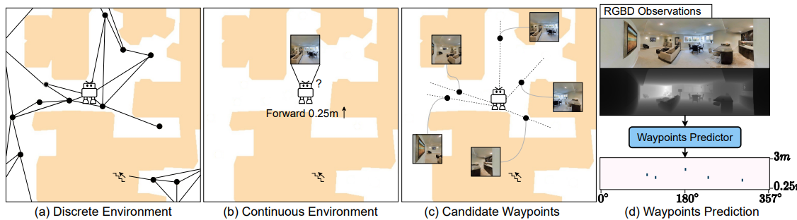
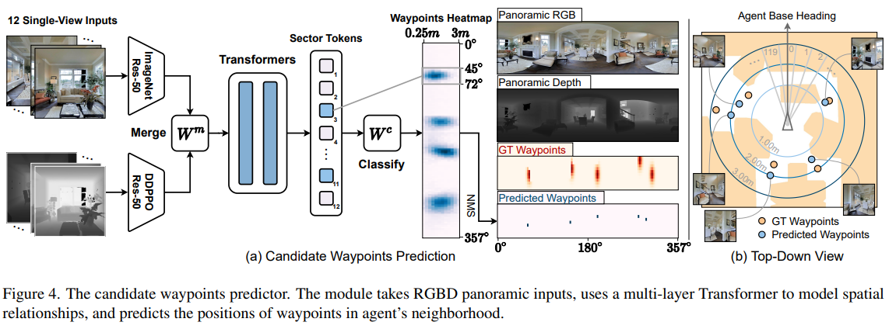
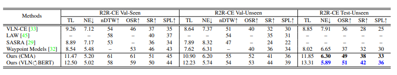

## 一、文章大概内容介绍

这篇论文探讨了视觉与语言导航（VLN）领域中离散环境与连续环境之间的学习鸿沟问题 。为了解决这一问题，作者**构建了**一个候选航点预测器（Candidate Waypoints Predictor），能够在连续环境中预测可到达的位置，从而使得原本为离散环境设计的高级动作代理（agents）能够顺利转移到连续环境中进行训练和导航 。通过这种方式，代理在连续环境中的表现得到了显著提升 

## 二、现有的问题

现有的大多数VLN工作要么专注于离散环境，要么专注于连续环境，导致训练得到的智能体无法在两者之间泛化。虽然连续环境更接近现实世界，但训练难度显著更高。与此同时，离散VLN中的先进方法难以迁移到连续环境中，原因在于两者之间存在明显的领域差异。

两者的根本区别在于：
 离散导航依赖于**预定义的连接图（connectivity graph）**，从而将低层控制问题转化为在图节点之间的高层跳转

在离散环境中：

- agent知道所有可达位置
- 每一步只需选择方向

而在连续环境中：

- agent必须自己推断可达性
- 并执行低层控制（转角、移动）

这导致问题复杂度大幅提升

高层动作的优势主要体现在两个方面：

1. **视角选择（View Selection）**
    将低层控制问题转化为选择一个可导航方向，从而显著简化决策过程。
2. **路径点跳转（Waypoint Teleportation）**
    智能体可以直接跳转到目标waypoint，从而提高导航效率。

实验结果表明：

- 视角选择显著提升性能
- waypoint跳转减少执行时间
- 可达性信息是导航学习的关键瓶颈

## 三、候选路径点预测器

为了弥合离散与连续之间的差距，我们提出一种候选路径点预测器，在连续环境中动态生成可导航的waypoints。在每一个时间步，该预测器会构建一个局部子图，表示从当前agent位置出发可以到达的方向和位置。

**1. 视觉输入与特征提取 (Inputs & Feature Extraction)**

- 系统首先接收代理（Agent）周围的12个单视角图像，这些图像涵盖了360度的全视野 。
- 输入分为RGB图像和深度（Depth）图像两路 。
- RGB图像通过在ImageNet上预训练的ResNet-50网络提取视觉特征，而深度图像则通过专门为点目标导航预训练的ResNet-50提取几何特征 。

**2. 特征融合 (Merge $W^m$)**

- 提取出的每一对RGB和深度特征会通过一个非线性层（由图中的 $W^m$ 表示）进行合并，生成包含丰富视觉和深度信息的综合特征 。

**3. 空间关系建模 (Transformers)**

- 合并后的12个视角的特征序列被送入包含两层的多层Transformer网络中 。

- **局部空间特征融合**：由于每张图像拥有90度的视野，这意味着相邻的图像之间存在视觉重叠 。因此，在**构建** Transformer 时，我们限制了自注意力（self-attention）机制的计算范围：让每个视角的特征（$v_{i}^{rgbd}$）只与其左边（$v_{i-1}^{rgbd}$）和右边（$v_{i+1}^{rgbd}$）的相邻视角特征进行交互 。这里使用 Transformer 完全是作为一种基础的空间特征提取基础网络，并不涉及任何大模型相关的技术。

  **Token 的实际含义**：经过 Transformer 层处理后输出的特征向量（$\overline{v}_{i}^{rgbd}$）即为图中的“Sector Token” 。这12个 Token 中的每一个，都独立包含了一个以当前图像中心为基准的“扇区”内的综合信息 。它不仅记住了当前视角的画面，还融合了左右相邻视角的空间结构关系。

**4. 航点热图生成 (Waypoints Heatmap & Classify $W^c$)**

- 输出的扇区标记随后输入到一个多层感知机分类器（图中 $W^c$）中 。
- 该分类器将这些特征映射为一个二维的概率热图（Waypoints Heatmap） 。热图的纵轴代表距离（从0.25米到3米），横轴代表相对于代理的角度（0°到357°） 。热图上的深蓝色区域代表该位置存在可通行航点的概率较高 。

**5. 后处理与离散化 (NMS)**

- 为了得到具体的航点坐标，系统对生成的热图执行非极大值抑制（NMS）操作，提取出局部极大值点，这些点就是最终生成的离散“预测航点”（Predicted Waypoints） 。

**6. 数据生成与训练流程**

1. **基准连通图的迁移与清洗 (Graph Projection & Cleaning)**

- **迁移**：作者首先使用了 Matterport3D (MP3D) 环境中已经预先定义好的离散连通图 。
- **清洗**：原始的连通图中存在很多不合理的“穿模”现象（例如边缘穿过墙壁或家具） 。为了解决这个问题，作者**构建了**一套启发式算法，在 Habitat 连续仿真环境中对这些图进行了修正 。他们通过重新采样、合并多余节点以及添加绕路节点，确保修正后的连通图（$\mathcal{G}^{*}$）上的所有节点和连线都严格位于无障碍的“开放空间（openspace）”中 。这个干净的图就是生成训练数据的基础。

2. **制作目标标签：真实热图 (Ground-Truth Heatmap)**

有了干净的连通图后，作者在图上的每一个节点（也就是代理可能站立的位置）构建其局部子图，以此来生成监督标签：

- **空间网格化**：作者将该节点周围 **3米** 半径内的区域进行了精细的网格化划分。具体来说，按角度切分为120个扇区（每 **3°** 一个），按距离切分为12个圆环（每 **0.25米** 一环） 
- **航点投影**：然后，将该节点在连通图上相邻的实际可达航点，映射到这个网格中，从而生成了一个 **120×12** 尺寸的二维矩阵，这就是“真实热图” 。
- **高斯平滑**：为了降低模型的训练难度并允许一定的预测误差，作者并没有把航点设定为绝对的单点（Hard label），而是用高斯分布（方差设定为 **1.75米** 和 **15°**）在热图上表示每个航点 。

3. **获取对应的视觉输入 (Visual Inputs)**

- 在连通图的每一个节点位置，代理会环视四周，收集 12 张相隔 **30°** 的 RGB 和深度（Depth）单视角图像 。

- 这 12 张多模态图像组合起来作为模型的输入数据（Input），而上一步生成的 **120×12** 高斯热图则作为模型需要拟合的目标标签（Target） 。

## 四、导航器

**1. 视觉编码器 (Visual Encoders)**

这两种代理网络在前端使用了相同的RGB和深度（Depth）编码器来处理各个候选视角的图像。

- **特征提取**：采用两个固定的ResNet-50网络。其中一个在ImageNet上进行了预训练，用于提取2048维的RGB视觉特征；另一个在Gibson上进行了预训练，用于提取128维的深度几何特征。
- **特征融合与方向编码**：提取出的RGB特征和深度特征会与方向编码（Directional Encoding）拼接在一起，然后通过一个带有ReLU激活函数的线性层进行映射融合。方向编码是通过将特定视角的相对偏航角（heading angle）的余弦和正弦值复制32次来构成的，由于这里构建的是二维平面图，因此不包含仰角信息。
- **最终维度**：经过融合后，提供给CMA代理的视觉特征维度为512，提供给VLN$\circlearrowright$BERT的维度为768。

**2. 语言编码器与初始状态 (Language Encoders and Initial States)**

对于自然语言导航指令，两种网络的编码方式和状态初始化有所区别：

- **CMA**：使用双向LSTM（Bi-LSTM）结合随机初始化的词嵌入来对语言指令进行编码。该代理的初始状态被设定为一个全零向量。
- **VLN$\circlearrowright$BERT**：利用双流视觉-语言Transformer中的语言流来处理指令，并且应用了预训练好的词嵌入。它提取预定义的 `[CLS]` 标记（分类标记）的输出，将其作为代理的初始状态。

**3. CMA 策略网络细节 (CMA Policy Network)**

CMA网络是一个基于序列到序列（Seq2Seq）的循环网络架构。

- **状态更新**：在每一个导航步，代理的状态会通过一个GRU（门控循环单元）进行更新。GRU的输入包含了上一步的视觉注意力特征以及经过映射的上一动作决策（包含方向信息）。
- **注意力机制**：代理首先利用前一时间步的状态作为查询向量（Query），对当前的候选视觉特征执行基于点积的软注意力（Soft-Attention）计算。随后，利用GRU更新后的当前状态，再次分别对文本特征和视觉特征计算注意力权重，得到更新后的文本与视觉上下文表示。
- **动作预测**：最后，网络将当前状态、更新后的视觉特征和文本特征拼接在一起，通过Softmax层计算出选择各个候选方向的概率。

**4. VLN$\circlearrowright$BERT 策略网络细节 (VLN$\circlearrowright$BERT Policy Network)**

VLN$\circlearrowright$BERT 采用的是基于Transformer的多层注意力架构。

- **结构简化**：为了降低网络复杂性，作者去除了原始模型中状态细化阶段的跨模态匹配模块，因为该模块带来的性能提升非常微小。
- **跨模态注意力**：网络通过多层Transformer，在代理的当前状态（其内部结合了上一动作的方向编码）、编码后的语言特征以及当前的视觉输入特征之间，直接进行跨模态的软注意力交互。
- **动作预测**：其动作概率的计算方式与CMA不同。它是通过提取最后一个Transformer层中，所有注意力头对于各个视觉标记（Visual Tokens）相对于代理状态的平均注意力权重，来直接作为对应方向的动作概率。

## 五、实验

