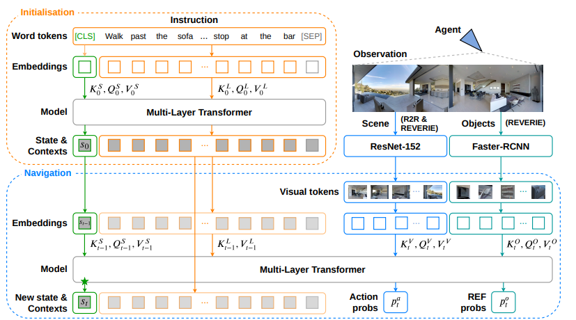

## 一、文章大致内容介绍

这篇论文提出了一种名为 VLN$\circlearrowright$BERT 的循环视觉与语言模型（Recurrent Vision-and-Language BERT），专门用于解决视觉语言导航（Vision-and-Language Navigation, 简称 VLN）任务 。由于 VLN 本质上是一个部分可观察的马尔可夫决策过程，传统的预训练 BERT 架构难以直接处理需要结合历史信息进行注意力分配和决策的场景 。为了解决这一难题，作者在原有的预训练 BERT 模型中巧妙地加入了一种循环机制，使智能体能够动态维护跨模态的状态信息 。同时，通过简化导航过程中的注意力计算方式，该模型大幅降低了长序列带来的巨大显存消耗 。实验结果表明，该模型在 R2R 和 REVERIE 两个主流数据集上都取得了当时的最先进（State-of-the-Art）成果，并且展示了其在联合处理导航和指代表达等多任务学习上的巨大潜力 。

## 二、当前存在的问题

虽然视觉与语言 V&L 预训练在其他领域很成功，但直接将其应用于 VLN 具有困难。首先，VLN 中未来的观察取决于智能体当前的状态和动作，且每一步的视觉观察只对应部分文本指令，要求智能体追踪进度并定位相关子指令 。其次，计算成本极高；如果每一步都对极长的视觉和文本序列进行自注意力计算，会消耗极大的 GPU 内存 。

## 三、提出的模型

